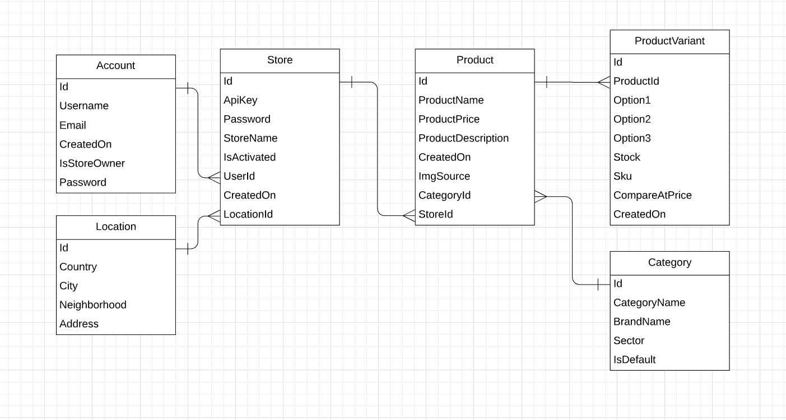

Database Design
===============

As seen the ER Diagram below, we designed the database to store
the User's Store and associate the Products to that Store. 

Each product has many Variants and Categories. It helps to
store different Products and makes us able to categorize them.

<<<<<<< HEAD
Also Location table is useful to store Store's address in a sensible way.

Classes
=======

We provided 2 classes to handle the abstraction and logic: 

* shopify_controller 
* database (DB operations, db_ops.py)

shopify_controller
-------------------

Simply a bridge to the User's Shopify Store. 
It can be initialized with a config which provides 
ApiKey and Password taken from User's Shopify Store

.. code-block:: python

    class shopify_controller:

        def __init__(self, config):
            self.config = config

        # Connects to the store
        def connect(self)

        # Gets all of the products
        def get_products(self)

        # Gets the product wight spesified id
        def get_product(self, product_id)

        #Updates a product
        def update_product(self, product_id, product)

database (DB operations, db_ops.py)
------------------------------------

The class which we put all of the database functions

.. code-block:: python

    class database:
        def __init__(self):
            self.connection = None
            self.url = url
=======
Location

Product
>>>>>>> 333e76e055514e4a720bb78e0b2df5871a68643d

Category

.. toctree::

   serhat
   oytun
